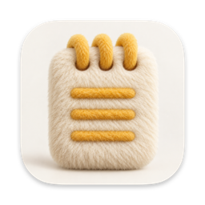

<p align="center">
  
</p>

# SyncedNotes

Encrypted notes for the Mac, written natively in Swift. No server, no account, no cloud: your
notes are locked with a passphrase only you know, and they never leave the Mac, not even to
Apple.

**Version 0.1.0.** In daily use by its author; not independently reviewed. What comes next is
in [`TODO.md`](TODO.md).

## What it does

- **Rich notes.** Titles, headings and body text; bulleted, numbered and dashed lists;
  checklists you can indent with Tab; tables; pictures; dividers; quotes and code; bold,
  italic, underline and strikethrough; highlights and text colours. Arabic and other
  right-to-left text runs in its own direction.
- **A new note starts as its title.** Press Return and the body follows.
- **Folders, inside folders.** Drag notes onto a folder, or right-click a note and choose
  Move To. Select several notes with ⌘-click or ⇧-click to move or delete them together.
- **A Trash.** Deleted notes stay there for 30 days and can be restored.
- **Search** over every word of every note.
- **Paste from anywhere.** Text pasted from a web page or another app takes the note's own
  font, size and colour, keeping bold, italic, lists and pictures. Copying between notes keeps
  everything. A picture can be clicked, copied, and pasted into other apps.
- **Light and dark mode**, with text that stays readable when the Mac switches between them.
- **Encrypted backups** to a file you choose, and a passphrase you can change at any time.

## Your passphrase

The first time you open SyncedNotes, you choose a passphrase. You type it every time you open
the app, and **there is no way to recover it**: no copy of it is kept anywhere. Keep a backup
(the Backup menu at the bottom of the sidebar, or File > Export Backup…) somewhere safe.

To change it, click the key in the toolbar, or use Settings (⌘,) or File > Change Passphrase….
Every note and picture is locked again with the new passphrase and checked before the old
copy is deleted, so stopping half way never loses anything. Backups made before the change
still open only with the old passphrase, so export a new one afterwards.

Every passphrase field has an eye button to show what you typed.

## Keyboard shortcuts

| | |
|---|---|
| New Note, New Folder | ⌘N, ⇧⌘N |
| Lock Notes | ⌃⌘L |
| Export Backup, Import Backup | ⇧⌘E, ⇧⌘I |
| Title, Heading, Subheading, Body | ⌥⌘1, ⌥⌘2, ⌥⌘3, ⌥⌘0 |
| Bulleted, Dashed, Numbered List | ⇧⌘7, ⇧⌘8, ⇧⌘9 |
| Checklist, Mark as Checked | ⇧⌘L, ⇧⌘U |
| Indent or outdent a list or checklist item | Tab, ⇧Tab |
| Table, Block Quote | ⌥⌘T, ⌘' |
| Bold, Italic, Underline, Strikethrough | ⌘B, ⌘I, ⌘U, ⇧⌘X |
| Highlight, Show Colors | ⇧⌘H, ⇧⌘C |
| Bigger, Smaller | ⌘+, ⌘− |
| Align Left, Center, Align Right | ⌘{, ⌘\|, ⌘} |
| Increase Indent, Decrease Indent | ⌘], ⌘[ |

Lists also start as you type: `- `, `* ` or `1. ` at the start of a line.

## Privacy

Note content never leaves the Mac, and Apple is treated as a vendor like any other, not
trusted: no iCloud, no Siri or Apple Intelligence, no Writing Tools, no Dictation or AutoFill,
no Look Up, Translate, Share or Services, no Handoff or Universal Clipboard, no Spotlight
indexing, no analytics or crash reporting. Windows are kept out of screenshots and screen
recording, so the app shows blank in a screenshot. The app runs in the App Sandbox with no
network access, so macOS itself stops it connecting anywhere, and it is built and signed on
the Mac without any Apple account. The full rule, how each part of it is kept, and the system
settings to switch off yourself are in [`Privacy.md`](Privacy.md).

Your notes live in the app's own sandbox folder,
`~/Library/Containers/com.syncednotes.mac/Data/Library/Application Support/SyncedNotes`, in a
database locked as a whole, holding each note and picture locked again on its own
([`Docs/LockFormat.md`](Docs/LockFormat.md) has every byte).

## Build and install

Requires macOS 26 and Xcode 26. Open `SyncedNotes.xcodeproj` and press Run, or:

```bash
xcodebuild -project SyncedNotes.xcodeproj -scheme SyncedNotes -configuration Debug \
  -derivedDataPath build build
open build/Build/Products/Debug/SyncedNotes.app
```

To try the app without touching your real notes, launch a debug build with
`-NotesFolder SyncedNotes-Try`: it keeps its notes in a separate folder beside the real one.

To install it for everyday use, build the release version, copy it to `/Applications`, and
delete the build's copy, so there is only one SyncedNotes on the Mac:

```bash
xcodebuild -project SyncedNotes.xcodeproj -scheme SyncedNotes -configuration Release \
  -derivedDataPath build build
ditto build/Build/Products/Release/SyncedNotes.app /Applications/SyncedNotes.app
rm -rf build/Build/Products/Release/SyncedNotes.app
```

Quit SyncedNotes before replacing it; it saves as it quits. The release build may use the
sandbox, files you pick in a Save or Open dialog, and the libraries bundled inside it
(`SyncedNotes.entitlements` says why), and unlike a debug build no debugger can attach to it
and read unlocked notes from its memory. Both builds use the same notes.

If the command-line tools rather than Xcode are the selected developer directory
(`xcode-select -p`), put `DEVELOPER_DIR=/Applications/Xcode.app/Contents/Developer` in front of
the commands.

## The project

| | |
|---|---|
| `SyncedNotes/` | The app: SwiftUI windows around an AppKit text view on TextKit 2 |
| `SyncedNotesCore/` | Everything that is not on screen, tested from the terminal: the lock, the encrypted database, folders, backups, changing the passphrase |
| `SyncedNotesCore/Proto/note.proto` | The note format; the Swift code in `Sources/SyncedNotesCore/Generated` is made from it |
| `SyncedNotesCore/Fixtures/` | The lock's test files, written by the lock code itself |
| `Vendor/GRDB` | GRDB with SQLCipher, pinned and vendored (see its `VENDORED.md`) |
| `Docs/` | Why it is built the way it is: [`Architect.md`](Docs/Architect.md) for the app, [`LockFormat.md`](Docs/LockFormat.md) for the encryption, byte for byte |
| `Privacy.md`, `TODO.md` | The privacy rule and how it is kept; what comes next |
| `Design/`, `Scripts/` | The icon's artwork, and the script that makes the app icon from it |

Dependencies, each pinned to one version: GRDB with SQLCipher 4.19.0 (vendored),
swift-sodium 0.11.0 for Argon2id, and swift-protobuf 1.38.1. Encryption itself uses Apple's
CryptoKit (AES-256-GCM, HKDF).

### Tests

```bash
cd SyncedNotesCore && swift test
```

67 tests: the lock, the database, backups, folders, the Trash and changing the passphrase,
including that nothing readable reaches the disk, that a change of passphrase stopped at any
point loses nothing, and that the committed lock test files are exactly what the lock code
writes.

### Generated files

Never edited by hand. Made again with:

```bash
# The note format's Swift code, after a change to note.proto
# (protoc, and protoc-gen-swift 1.38.1 to match swift-protobuf):
cd SyncedNotesCore/Proto && protoc --swift_out=../Sources/SyncedNotesCore/Generated \
  --swift_opt=Visibility=Public note.proto

# The lock's test files, only after a deliberate change to the lock format:
cd SyncedNotesCore && swift run make-fixtures

# The app icon, from Design/AppIcon-artwork.png:
swift Scripts/make-app-icon.swift
```

## Roadmap

Automatic encrypted backups, auto-lock and Touch ID come first; then find and replace, links,
tags, export to Markdown and PDF, and note history. An iPhone app with sync between your own
devices, over the local network only, is further off. The full list is in [`TODO.md`](TODO.md).

## License

MIT, see [`LICENSE`](LICENSE). The vendored GRDB keeps its own MIT license
([`Vendor/GRDB/LICENSE`](Vendor/GRDB/LICENSE)).
